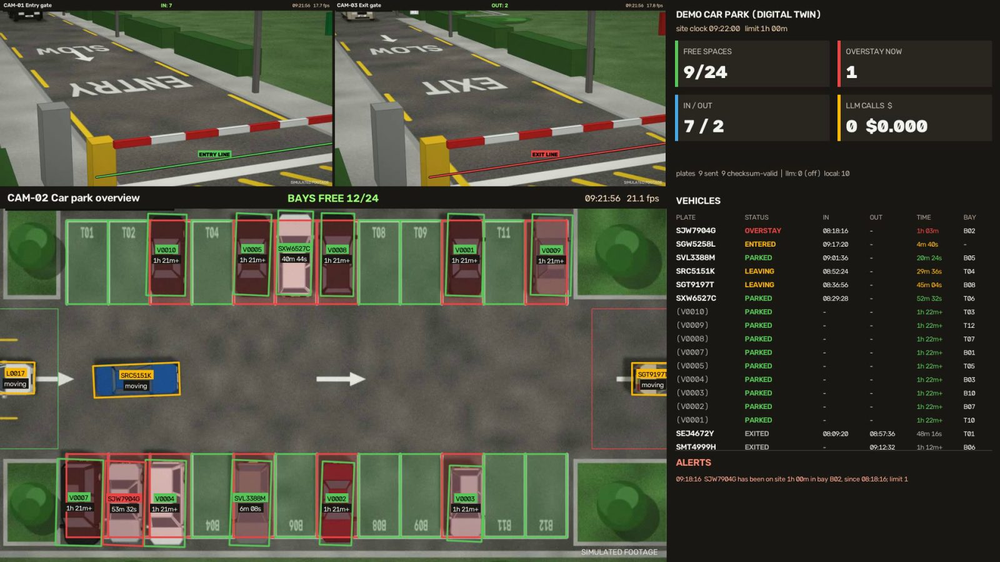
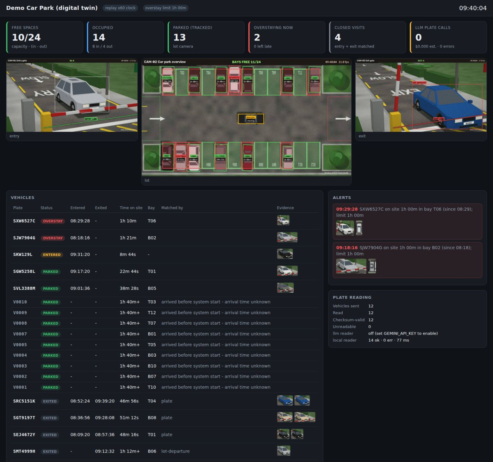

# ParkWatch: CCTV-only car-park monitoring (YOLO + LLM plate reading)

ParkWatch answers four questions from CCTV alone. It needs no sensors, barriers or tickets:

| #  | Question | How it is answered |
|----|----------|--------------------|
| P1 | How many spaces are free right now? | Counted at the gates: `free = capacity − (initial + entries − exits)`. The lot camera also shows bay-level occupancy. |
| P2 | Which vehicle is this, and when did it arrive? | The entry camera reads the plate **once per vehicle** (vision LLM or free local OCR) and records the entry time. |
| P3 | How long has each vehicle been parked? | The overhead camera detects when a car stops in a bay. Its timer runs from the entry time. |
| P4 | Has it left, and did it overstay? | The exit camera reads the plate again and closes the visit. Overstays raise an alert with evidence images. |

The repo is a complete, runnable client demo:

* **A synthetic "digital twin" car park**: three virtual cameras (entry gate, overhead lot, exit gate) watching *the same* cars. Each car has a valid Singapore plate and a ground-truth timeline. Unlike clips from three unrelated sites, this lets you show a whole visit end to end (entry → bay → overstay alert → exit) and score the system against what really happened.
* **The pipeline** (`parkwatch/`): edge cameras emit small JSON events, and a central service owns identity, timers, capacity and alerts. It writes SQLite, CSV and JSONL, and serves a live web dashboard.
* **Tools** to draw lines and bays on your own footage, generate training data, and fine-tune.



---

## Quick start (about 10 minutes)

```bash
python -m venv .venv && source .venv/bin/activate      # Windows: .venv\Scripts\activate
pip install -r requirements.txt                        # PyTorch comes with ultralytics; install the CUDA build first if you have a GPU

python tools/make_demo_videos.py                       # renders assets/demo/{entry,lot,exit}_cam.mp4 (3 min each, ~5 min on a laptop)
python run_demo.py --realtime                          # plays like live CCTV; open http://localhost:8000
```

Optional: read plates with Gemini instead of the free local reader. Without a key the demo still works fully offline:

```bash
export GEMINI_API_KEY=...        # Windows PowerShell: $env:GEMINI_API_KEY="..."
```

Useful flags:

| flag | effect |
|------|--------|
| `--realtime` | paces to the wall clock like a live feed. If the CPU falls behind, frames are dropped (not queued), exactly as with RTSP. |
| `--show` | also opens an OpenCV window with the control-room mosaic (needs the GUI build `opencv-python`). |
| `--hold` | keeps the dashboard up after the footage ends, for Q&A. |
| `--max-seconds 60` | processes only the first minute (quick check). |
| `--no-web`, `--no-video` | turns off the dashboard or the `annotated_mosaic.mp4` recording. |

Every run writes `runs/<timestamp>/`, containing:
* `annotated_mosaic.mp4`: a recording of the control-room view. **Keep one as a backup for the client meeting.**
* `sessions.csv` and `parking.db` (SQLite): one row per visit (plate, in, out, duration, bay, status, match method).
* `events.jsonl` and `alerts.jsonl`: every edge event and alert, the same JSON that would cross the network in production.
* `evidence/`: the plate crop used for each read and the lot snapshot attached to each overstay alert.
* `evaluation.json`: scoring against ground truth (synthetic clip only).

## What happens in the demo clip

The site clock starts at 08:00 (times below are from a measured run and can shift by a minute, because a car may be counted while waiting at the barrier or as it passes). For the demo only, `time_scale: 60` makes 1 second of footage count as 1 minute, so the real 1-hour rule plays out in 3 minutes. Detection timings still run in real video seconds, and production uses `time_scale: 1`.

| site time | event | what to point at |
|-----------|-------|------------------|
| 08:00 | 10 cars already parked. The lot camera finds them in their bays within ~4 s. | Their timers carry a `+`: the arrival time is unknown, so the system shows a lower bound and does not accuse. |
| ≈08:09 | `SEJ4672Y` enters. The plate is read once, and the car is followed to bay T01. | Evidence thumbnail. Plate calls = 1 per car, not per frame. |
| ≈08:58 | `SEJ4672Y` exits after 48 min → **EXITED**, matched by plate. | P4 closed with in/out times. |
| ≈09:12 | `SMT4999H`, parked before start-up, leaves. | Exit with no entry record: matched through the lot camera and flagged "arrived before system start". |
| **≈09:18** | **`SJW7904G` passes 1 h in bay B02 → OVERSTAY alert** with the entry plate crop and a lot snapshot. | The alert panel. The webhook would notify enforcement. |
| ≈09:29, 10:01, 10:31, 10:55 | four more overstays (`SXW6527C`, `SVL3388M`, `SKW129L`, `SPS3000R`) | Dashboard "Overstaying now". |
| ≈10:14 | `SJW7904G` finally leaves → **EXITED_OVERSTAY 1h 55m** and an "overstay exit" alert. | "At what time it exited" is answered. |
| end | accuracy report against ground truth, printed in the terminal | Measured numbers for the client, not claims. |

## Measured results (synthetic clip, CPU only)

Result of `python run_demo.py` on a 4-core CPU with no GPU and no LLM key (local fast-alpr reader). The report is printed at the end of every run:

| Check (ground truth vs. system) | Result |
|---|---|
| Entries detected / entry plates correct | **13/13**, **13/13** |
| Exits detected / exit plates correct | **8/8**, **8/8** |
| Visits closed on the right entry (P4) | **6/6**, plus 2 pre-start cars closed through the lot camera |
| Parked bay correct (P3) | **13/13** (and all 10 pre-parked cars found in the right bays) |
| Overstays flagged / false alarms | **4/4**, **0** |
| Final count (P1) | 15 occupied, 9 free: matches ground truth |
| Plate reads | 21 vehicles → 21 checksum-valid reads, 0 LLM calls needed |



Speed on this 4-core CPU: gate cameras ≈ 17 inferences/s (YOLO11s @ 512), lot camera ≈ 22 inferences/s (YOLO11n-OBB @ 640). All three cameras together ran at about 0.6× real time, so `--realtime` drops some frames on a CPU-only laptop. Any recent NVIDIA GPU runs all three cameras in real time.

> **Say this to the client:** the twin shows the *logic* working end to end with known answers. Detection and plate-reading accuracy on *their* cameras must still be measured on *their* footage. See [Known limitations](#known-limitations).

---

## Architecture

```
ENTRY CAM ─ detect(YOLO11s) → track(BoT-SORT) → green-line crossing ─┐   best crops → PlateService (async)
LOT CAM   ─ detect(OBB)     → track(BoT-SORT) → stationary ≥ N s ───┤              │ LLM (Gemini via Ultralytics LLM) → rotate on 429/503
EXIT CAM  ─ detect(YOLO11s) → track(BoT-SORT) → red-line crossing ───┤              │ local fast-alpr (free, offline)
                                                                     ▼              ▼ checksum-validated plate
                                                  JSON events ──► CENTRAL SERVICE ──► SQLite / CSV / alerts / dashboard
```

* **Edge roles are dumb and cheap.** They emit `entry`, `exit`, `lot_arrival`, `parked`, `unparked` and `lot_departure` events. No video crosses the network, and remote edges can `POST /api/events`.
* **Identity, most reliable first:** (1) the plate, read once at a gate; (2) lot position, so a new tracker ID within 45 px of a parked car *is* that car (this is what cut 110 IDs to 76 on your aerial clip); (3) the tracker ID, which is only trusted inside one camera.
* **Cross-camera linking without re-ID models:** an entry is linked to the next car that appears in the lot's entry zone (FIFO within a time window). A car leaving through the lot's exit zone backs up the exit match when the exit plate is unreadable.
* **The LLM is never on the video thread.** Crops go to a worker pool. A 429/503 puts that model variant on cooldown and the next variant or the local reader is tried. Plates are validated (Singapore checksum), so most misreads are caught without a second paid call.

Details and the reasoning behind each choice are in [docs/APPROACH.md](docs/APPROACH.md). Datasets and test footage are in [docs/DATASETS.md](docs/DATASETS.md). The meeting talk track is in [docs/DEMO_SCRIPT.md](docs/DEMO_SCRIPT.md).

## Using your own footage or live cameras

```bash
cp configs/site_template.yaml configs/my_site.yaml
python tools/draw_zones.py --source path/to/gate.mp4 --camera entry --out configs/my_site_geometry.json   # click the counting line
python tools/draw_zones.py --source path/to/lot.mp4  --camera lot   --out configs/my_site_geometry.json   # click bays + entry/exit zones
python run_demo.py --config configs/my_site.yaml --realtime
```

`source` can be a file, an RTSP URL (`rtsp://user:pass@ip:554/stream`), or a webcam index. For real aerial footage use the stock `yolo11s-obb.pt` (DOTA classes `small vehicle` / `large vehicle`) at `imgsz: 1024` or higher. `models/twin_obb.pt` is tuned to the rendered twin only.

## Plate reading options

| provider | cost | data leaves site? | set up |
|----------|------|-------------------|--------|
| Gemini through `ultralytics.LLM` (default first choice) | ~$0.001 per car | yes | `GEMINI_API_KEY` |
| Local vision LLM (e.g. Qwen2.5-VL on Ollama or vLLM) | hardware only | no | `llm.model: qwen2.5vl:7b`, `llm.base_url: http://localhost:11434/v1` |
| fast-alpr (ONNX plate detector + OCR, CPU) | free | no | installed by `requirements.txt` |

Order is set by `plates.providers`. `[llm, local]` means LLM first, with local as the fallback when the LLM is down. `[local, llm]` means *pay only for the hard cases*.

## Regenerating the synthetic data and model

```bash
python tools/make_demo_videos.py             # demo clip + ground_truth.json + scene_geometry.json
python tools/make_training_data.py           # 5 random episodes (different cars/timings) → datasets/ (auto-labelled)
python tools/train_twin.py --task obb        # fine-tune YOLO11n-OBB → models/twin_obb.pt (mAP50 0.995 after ~9 epochs on CPU)
pytest -q                                    # 14 unit tests: checksum, line crossing, central logic, re-ID, LLM 429/503 rotation
```

Why fine-tune for the twin? It reproduces constraint C3. Stock COCO weights label the top-down rendered cars "cell phone", and stock DOTA-OBB weights (made for aerial photos) call them "ship". Ten minutes of training on auto-labelled frames from *different* random episodes fixes this. Doing the same with real labelled frames is the site-adaptation step for a real deployment.

## Project layout

```
run_demo.py                 entry point
configs/demo.yaml           fully commented demo config;  site_template.yaml for real sites
parkwatch/
  edge.py                   GateCamera (line crossing, best crops) and LotCamera (parked state, position re-ID, bays)
  central.py                sessions, linking, capacity, overstay, alerts
  plates/                   LLM + local readers, async PlateService, SG checksum validation
  detector.py sources.py    YOLO + BoT-SORT wrapper; file / RTSP sources on a shared media clock
  runner.py annotate.py     lockstep multi-camera loop; overlays + 1920x1080 control-room mosaic
  dashboard/                stdlib web server (MJPEG + JSON) and the single-page dashboard
  store.py alerts.py evaluate.py clock.py
simulator/                  tiny 3D renderer, car models with real plates, scenario + ground truth
tools/                      make_demo_videos, make_training_data, train_twin, draw_zones
models/twin_obb.pt          overhead model fine-tuned on the twin (5.6 MB)
tests/                      pytest suite
```

## Known limitations

1. **The demo clock is compressed** (1 s = 1 min). The logic and the 60-minute limit are identical to production. Only `time_scale` changes.
2. **The synthetic footage is rendered, not filmed.** It proves the logic and the event flow. Detection and OCR accuracy must be re-measured on the client's cameras. Label it "simulated" in the meeting (the videos carry a watermark).
3. **Cross-camera linking is order-based.** That is fine for a single-lane entry into a lot the camera sees, and weaker for multi-lane sites. Appearance re-ID is next-step work.
4. **Gate camera placement is the biggest accuracy factor** (plate height, angle under ~30°, IR at night, shutter under 1/500 s), more than any model choice.
5. **Plates with timestamps are personal data** (in Singapore, under the PDPA). Agree retention, signage and access control before launch.
